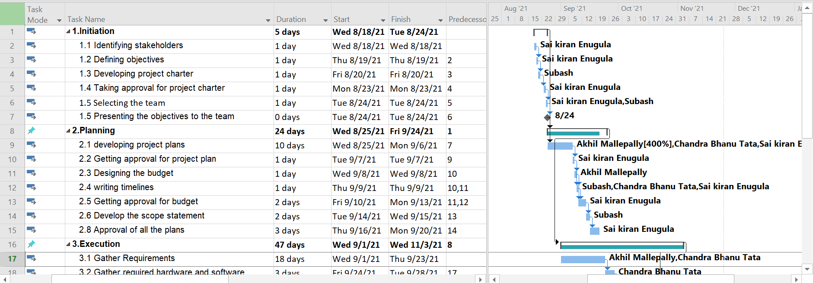
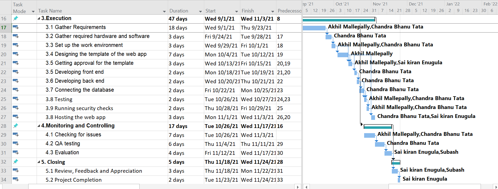
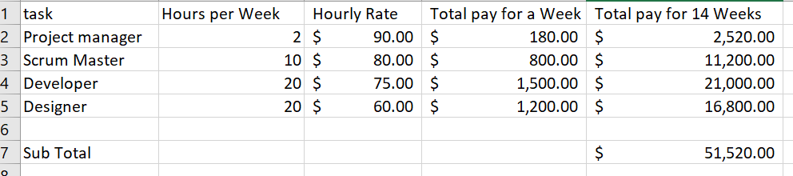

# pm-s03-g02-project

### Table of contents
  * [Our Project](https://github.com/akhilmallepally/pm-s03-g02-project#our-project)
  * [Our Team](https://github.com/akhilmallepally/pm-s03-g02-project#our-team)
  * [Project Charter](https://github.com/akhilmallepally/pm-s03-g02-project#project-charter)
  * [Scope](https://github.com/akhilmallepally/pm-s03-g02-project#scope)
    * [Initiation](https://github.com/akhilmallepally/pm-s03-g02-project#1-intiating)
    * [Planning](https://github.com/akhilmallepally/pm-s03-g02-project/blob/main/README.md#2-planning)
    * [Execution](https://github.com/akhilmallepally/pm-s03-g02-project#3-execution)
    * [Monitoring and Controlling](https://github.com/akhilmallepally/pm-s03-g02-project#4-monitoring-and-controlling)
    * [Closing](https://github.com/akhilmallepally/pm-s03-g02-project#5-closing)
  * [Schedule](https://github.com/akhilmallepally/pm-s03-g02-project#schedule)
  * [Budget](https://github.com/akhilmallepally/pm-s03-g02-project#budget)

### Our Project
* Campus Management System
* We are developing a web application which helps the students, faculty to get all the campus resources into one application. 
  This web application contains the user login page. an admin page and inner pages which displays the requirements that students and faculty can get from the campus resources. If there is no registered user, an authentication error is displayed. This acts as a single sign-on for every resource that is available digitally in the campus. 

### Our Team

         

[Subhash Nethra](https://github.com/Subhas19/)             &nbsp; &nbsp; &nbsp; &nbsp; &nbsp; &nbsp;&nbsp; &nbsp; &nbsp; &nbsp; &nbsp; &nbsp;          [Sai kiran Enugala](https://github.com/saikiranreddyenugala/)           &nbsp; &nbsp; &nbsp; &nbsp; &nbsp; &nbsp;&nbsp; &nbsp; &nbsp; &nbsp; &nbsp; [Tata Chandra Bhanu](https://github.com/tata1141/)   &nbsp; &nbsp; &nbsp; &nbsp; &nbsp; &nbsp;&nbsp; &nbsp; &nbsp; &nbsp; &nbsp; [Akhil Mallepally](https://github.com/akhilmallepally/)

### Project Charter

The project charter briefly comrpises of the objectives, team and budget information of our project.

 [Link to the project charter](https://github.com/akhilmallepally/pm-s03-g02-project/tree/main/charter_files/charter.md)

### Scope

#### Work Breakdown Structure

#### 1. Intiating
 * 1.1 Identify Stakeholders
 * 1.2 Defining objectives
 * 1.3 Developing project charter
 * 1.4 Taking approval for project charter
 * 1.5 Selecting the team
 * 1.6 Presenting the objectives to the team
 
#### 2. Planning 
 * 2.1 developing project plans
 * 2.2 Getting approval for project plan
 * 2.3 Designing the budget
 * 2.4 writing timelines
 * 2.5 Getting approval for budget 
 * 2.6 Develop the scope statement  
 * 2.7 Approval of all the plans
 
#### 3. Execution
  * 3.1 Gather Requirements
  * 3.2 Gather required hardware and software
  * 3.3 Set up the work environment
  * 3.4 Designing the template of the web app
  * 3.5 Getting approval for the template
  * 3.5 Developing front end
  * 3.6 Developing back end
  * 3.7 Connecting the database
  * 3.8 Testing
  * 3.9 Running security checks
  * 3.10 Hosting the web app

#### 4. Monitoring and Controlling
  * 4.1 Checking for issues
  * 4.2 QA Testing
  * 4.3 Evaluation
  
#### 5. Closing
  * 5.1 Review, Feedback and Appreciation
  * 5.2 Project Completion
 
 [Find the WBS sheet here](https://github.com/akhilmallepally/pm-s03-g02-project/blob/main/scope/wbs.mpp)

### Schedule
 Start Date : 08/18/2021
 
 End Date : 11/24/2021
 
 Duration : 14 Weeks
 
 
 

 [Find the detailed schedule here](schedule.mpp)
 
### Budget
Total project value is $70,000  
Total project cost is $51,520  
Estimated profits is $18,480  

[Find the detailed budget here](https://github.com/akhilmallepally/pm-s03-g02-project/blob/main/budget/budget.xlsx)
